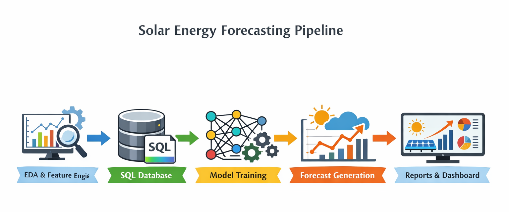
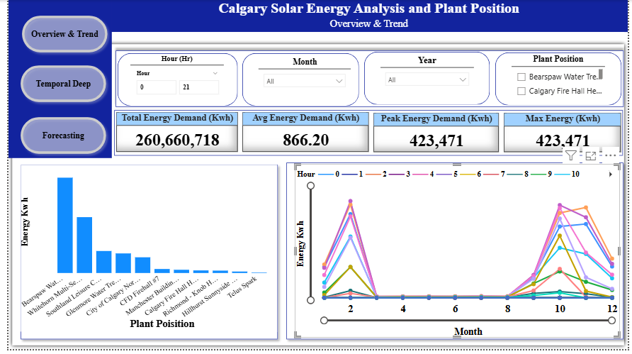
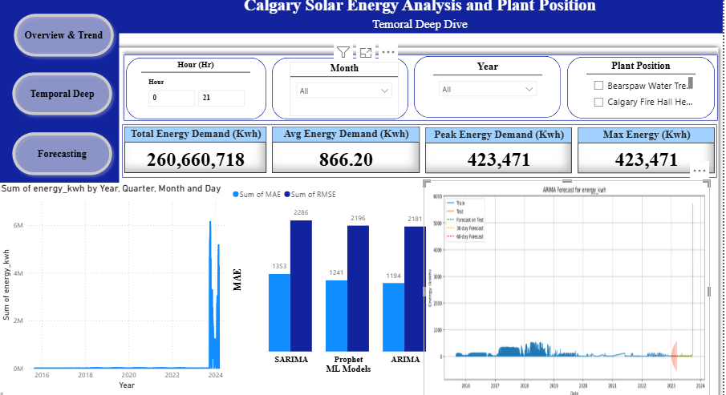
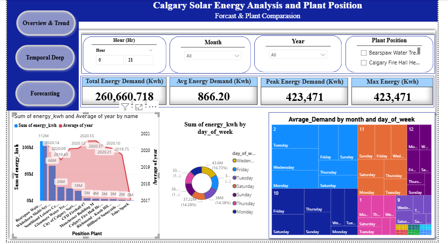

<h1 align="center">
Calgary Solar PV Energy Analytics & Forecasting Platform
</h1>

<strong>
From Raw Renewable Energy Data to Data-Driven Grid Intelligence
</strong>

  

<h2> Project Overview</h2>

The <strong>Calgary Solar PV Energy Analytics & Forecasting Platform</strong> is an end-to-end renewable energy analytics project developed to transform raw solar photovoltaic (PV) generation data into actionable operational and strategic insights.

The project focuses on analyzing historical solar energy production data collected from Calgary PV installations and demonstrates a complete real-world data analytics workflow:

<strong>
Raw Data → Data Engineering → SQL Analytics → Feature Engineering → Forecasting → Business Intelligence → Decision Support
</strong>

The platform integrates automated ETL pipelines, SQL-driven analytics, time-series forecasting models, and interactive Power BI dashboards to support renewable energy planning, grid integration, and operational decision-making.

Reliable solar energy forecasting is increasingly important for modern energy systems because renewable generation is highly dependent on weather conditions, seasonal variation, and daily production patterns. Accurate predictions help improve:

<ul>
<li>Operational efficiency in renewable energy management.</li>
<li>Grid stability through better renewable integration planning.</li>
<li>Energy storage scheduling and demand management.</li>
<li>Long-term sustainability strategies aligned with Calgary’s Net-Zero 2050 goals.</li>
</ul>

<h2> Aim of the Project</h2>

The primary objective of this project is to demonstrate how advanced data analytics and machine learning techniques can transform historical renewable energy data into actionable insights for energy stakeholders.

The project was designed to simulate a real-world analytics environment where data analysts and engineers must manage the complete lifecycle of an energy data solution, from raw data collection to executive-level reporting.

The main goals were to analyze historical solar generation behavior, identify temporal and seasonal patterns, forecast future energy production, and develop dashboards that support operational and strategic decisions.

Through this project, the following capabilities were demonstrated:

<ul>

<li>
<strong>Renewable Energy Analytics:</strong>
Understanding solar PV generation behavior across multiple years, locations, and operating conditions.
</li>

<li>
<strong>Data Engineering:</strong>
Building automated pipelines for data ingestion, cleaning, transformation, and database integration.
</li>

<li>
<strong>Time-Series Forecasting:</strong>
Developing predictive models to estimate short- and medium-term solar energy production.
</li>

<li>
<strong>Business Intelligence:</strong>
Creating dashboards that convert technical analysis into clear insights for decision-makers.
</li>

</ul>

<h2> Business Problem</h2>

Solar energy generation provides a sustainable alternative to traditional energy sources; however, renewable generation introduces unique analytical challenges. Solar production is naturally variable because it depends on sunlight availability, weather conditions, seasonal changes, and system performance.

Energy operators and planners need reliable analytical solutions to answer important questions:

<ul>

<li>
How much energy will solar installations generate in the future?
</li>

<li>
When are peak production periods occurring?
</li>

<li>
Which installations are performing efficiently or underperforming?
</li>

<li>
How can energy storage and grid operations be optimized?
</li>

</ul>

Traditional spreadsheet-based analysis is often limited because it requires manual data preparation, cannot efficiently process large historical datasets, and provides limited forecasting capability.

This project addresses these challenges by developing an automated analytics platform that combines:

<ul>

<li>
Large-scale historical solar energy data processing.
</li>

<li>
SQL-based analytical workflows.
</li>

<li>
Machine learning forecasting models.
</li>

<li>
Interactive business intelligence visualization.
</li>

</ul>

<h2> Dataset Overview</h2>

The dataset used in this project represents historical solar photovoltaic energy production from Calgary solar installations.

The data was obtained from the official City of Calgary Open Data Portal:

<strong>Dataset Source:</strong>
City of Calgary Open Data Portal

<strong>Dataset Name:</strong>
Solar Energy Production Sites

<strong>Data Access:</strong>
Open, public, machine-readable dataset available through CSV/API format

Source:
<a href="https://data.calgary.ca/dataset/Solar-Energy-Production-Sites/tbsv-89ps/about_data">
City of Calgary Solar Energy Production Sites Dataset
</a>

The dataset contains multi-year hourly solar PV generation measurements collected from geographically distributed installations across Calgary.

Each observation represents an hourly energy production record for a specific solar installation, making the dataset suitable for:

<ul>

<li>
Time-series analysis.
</li>

<li>
Seasonality detection.
</li>

<li>
Forecasting model development.
</li>

<li>
Site performance comparison.
</li>

<li>
Renewable energy planning.
</li>

</ul>

<h2> Dataset Characteristics</h2>

<table border="1" cellspacing="0" cellpadding="8">

<tr>
<th>Characteristic</th>
<th>Description</th>
</tr>

<tr>
<td>Data Source</td>
<td>City of Calgary Open Data Portal</td>
</tr>

<tr>
<td>Dataset</td>
<td>Solar Energy Production Sites</td>
</tr>

<tr>
<td>Time Period</td>
<td>2015 – 2024</td>
</tr>

<tr>
<td>Granularity</td>
<td>Hourly energy generation records</td>
</tr>

<tr>
<td>Dataset Size</td>
<td>Approximately 258,000 hourly observations</td>
</tr>

<tr>
<td>Coverage</td>
<td>Multiple solar PV installations across Calgary</td>
</tr>

<tr>
<td>Target Variable</td>
<td>Energy production (kWh)</td>
</tr>

</table>

<h2> Data Understanding</h2>

Before developing forecasting models, the dataset was carefully analyzed to understand data quality, structure, and operational characteristics.

The initial data assessment focused on identifying missing values, duplicate records, inconsistent formats, abnormal energy values, and site-level data availability.

The analysis revealed several important characteristics of solar energy datasets:

<ul>

<li>
<strong>Seasonal Imbalance:</strong>
Solar generation varies significantly throughout the year, with winter months showing lower production and higher uncertainty.
</li>

<li>
<strong>Outliers:</strong>
Extreme weather events and unusual operating conditions can create abnormal production values.
</li>

<li>
<strong>Zero Production Periods:</strong>
Nighttime hours, maintenance periods, and sensor issues can generate zero-output observations.
</li>

<li>
<strong>Feature Limitations:</strong>
Additional temporal and operational features are required to improve forecasting performance.
</li>

</ul>

Understanding these challenges was essential for designing a reliable data pipeline and selecting appropriate forecasting approaches.

<h2> ETL Pipeline & Data Engineering Workflow</h2>

A major focus of this project was building a reliable and reproducible data engineering workflow. Instead of performing analysis directly on raw files, an automated ETL architecture was developed to transform raw solar production records into structured analytical datasets.

The ETL workflow follows the industry-standard process:

<strong>
Extract → Transform → Load → Analyze → Visualize
</strong>

<h3> 1 Extract: Data Ingestion</h3>

The first stage of the pipeline focused on collecting and integrating raw solar energy production data from multiple source files.

Python-based ingestion workflows were developed to automatically load raw datasets and combine them into a unified analytical dataset.

<pre><code>
import pandas as pd
import glob

files = glob.glob('data/Solar/*.csv')

df_list = [pd.read_csv(f) for f in files]

solar_df = pd.concat(df_list,ignore_index=True)
</code></pre>

This automated extraction process improves reproducibility by eliminating manual file handling and ensuring that new data can be incorporated into the analytics workflow efficiently.

<h3>2 Transform: Data Cleaning & Feature Engineering</h3>

Raw renewable energy datasets often contain missing values, duplicate observations, inconsistent formats, and abnormal measurements. Therefore, a comprehensive data transformation process was implemented.

The cleaning workflow included:

<ul>

<li>
Removing duplicate records to maintain data integrity.
</li>

<li>
Handling missing values and incomplete observations.
</li>

<li>
Standardizing timestamps and categorical variables.
</li>

<li>
Converting data types for analytical processing.
</li>

<li>
Detecting abnormal production values and potential outliers.
</li>

</ul>

<h3>Feature Engineering</h3>

To improve forecasting performance and capture solar generation behavior, additional time-series features were created.

The engineered features included:

<ul>

<li>
<strong>Lag Features:</strong>
Previous energy production values such as t-1, t-24, and t-168 hours to capture short-term and weekly patterns.
</li>

<li>
<strong>Rolling Statistics:</strong>
Moving averages over different time windows (3-hour, 6-hour, and 24-hour periods) to reduce noise and identify trends.
</li>

<li>
<strong>Temporal Features:</strong>
Hour, day, month, season, weekday/weekend indicators for understanding solar production cycles.
</li>

<li>
<strong>Solar Operation Indicators:</strong>
Sunrise/sunset flags and production availability indicators.
</li>

<li>
<strong>Site Metadata:</strong>
Installation characteristics such as capacity, location, and operational age.
</li>

</ul>

These engineered variables allowed forecasting models to better understand the relationship between time, seasonality, and solar production behavior.

<h3>3️ Load: Database Integration</h3>

After preprocessing, the cleaned and engineered dataset was loaded into a relational database environment to support scalable analytics and business intelligence reporting.

SQLAlchemy was used to connect Python analytics workflows with database systems and create a database-driven analytics architecture.

<pre><code>
from sqlalchemy import create_engine

engine = create_engine(
    'postgresql://user:password/solar_energy_db')

solar_df.to_sql(
    'solar_energy_fact',
    engine,
    if_exists='replace',
    index=False)
</code></pre>

The database integration provided several advantages:

<ul>

<li>
Enabled structured storage of large-scale renewable energy datasets.
</li>

<li>
Created reproducible analytical workflows.
</li>

<li>
Supported SQL-based feature engineering and aggregation.
</li>

<li>
Allowed direct integration with Power BI dashboards.
</li>

<li>
Improved scalability compared with notebook-only analysis.
</li>

</ul>

<h2> SQL-Driven Analytics & Database Design</h2>

SQL played a central role in transforming raw renewable energy records into business-ready analytical datasets.

The database layer was designed to support operational reporting, forecasting analysis, and dashboard development.

<h3>Why SQL & ETL Pipelines?</h3>

A database-centric approach was selected because energy analytics requires processing large historical datasets while maintaining consistency, transparency, and reproducibility.

<ul>

<li>
Automates large-scale data processing.
</li>

<li>
Enables repeatable and auditable analytics workflows.
</li>

<li>
Supports Power BI dashboard integration.
</li>

<li>
Allows advanced aggregation and feature engineering directly in SQL.
</li>

<li>
Provides a foundation for future real-time analytics systems.
</li>

</ul>

<h3>SQL Analytics Workflow</h3>

The complete SQL workflow followed these steps:

<ol>

<li>
Extract raw solar production data from source files.
</li>

<li>
Clean and normalize datasets using Python and SQLAlchemy pipelines.
</li>

<li>
Create analytical database views for energy performance metrics.
</li>

<li>
Generate aggregated datasets for visualization and reporting.
</li>

<li>
Connect processed data to Power BI for dashboard development.
</li>

</ol>

<h3>Example SQL View: Total Energy Production by Site</h3>

<pre><code>
CREATE VIEW v_total_energy_per_site AS

SELECT
    name,
    SUM(energy_kwh) AS total_energy,
    AVG(energy_kwh) AS average_energy

FROM solar_energy_preprocessed

GROUP BY name;
</code></pre>

This database view enables:

<ul>

<li>
Site performance comparison.
</li>

<li>
Identification of high- and low-performing installations.
</li>

<li>
Automated dashboard reporting.
</li>

<li>
Operational decision support.
</li>

</ul>

<h2> Exploratory Data Analysis (EDA)</h2>

After completing the ETL process, exploratory data analysis was performed to discover hidden patterns, seasonal behavior, and operational characteristics within Calgary’s solar energy system.

The analysis focused on understanding how solar production changes across:

<ul>

<li>
Time of day.
</li>

<li>
Seasons and months.
</li>

<li>
Weekdays versus weekends.
</li>

<li>
Different PV installation sites.
</li>

</ul>

<h3>EDA Analysis Framework</h3>

<table border="1" cellspacing="0" cellpadding="8">

<tr>
<th>Analysis</th>
<th>Method</th>
<th>Business Insight</th>
</tr>

<tr>
<td>Total Energy per Site</td>
<td>SUM / AVG Aggregation</td>
<td>Identifies high-performing and underperforming solar installations</td>
</tr>

<tr>
<td>Hourly Production Pattern</td>
<td>Average Energy by Hour</td>
<td>Detects peak solar generation periods</td>
</tr>

<tr>
<td>Weekday vs Weekend Analysis</td>
<td>Average comparison</td>
<td>Supports operational planning and anomaly detection</td>
</tr>

<tr>
<td>Monthly & Seasonal Trends</td>
<td>Aggregation by Month / Season</td>
<td>Reveals seasonal volatility and production cycles</td>
</tr>

<tr>
<td>Rolling & Lag Analysis</td>
<td>Window Functions</td>
<td>Identifies short-term patterns and production fluctuations</td>
</tr>

</table>

<h2> Key EDA Findings</h2>

The exploratory analysis revealed several important renewable energy patterns:

<ul>

<li>
Solar production consistently reaches peak levels during daytime hours, especially between <strong>08:00 and 16:00</strong>.
</li>

<li>
Winter months demonstrate higher volatility due to reduced sunlight availability and weather impacts.
</li>

<li>
Summer periods create higher production surplus opportunities for storage optimization.
</li>

<li>
Site-level analysis shows that different installations require customized monitoring strategies.
</li>

<li>
Rolling averages and lag variables provide valuable signals for forecasting future production.
</li>

</ul>

These findings provided the foundation for the next stage of the project: developing forecasting models capable of predicting future solar energy generation.

<h2> Forecasting & Machine Learning Modeling</h2>

The forecasting stage focused on developing predictive models capable of estimating future solar PV energy production. Accurate forecasting is essential for renewable energy systems because it supports grid balancing, energy storage planning, maintenance scheduling, and operational decision-making.

Multiple time-series forecasting approaches were evaluated to understand which models could best capture Calgary’s solar generation patterns, seasonal behavior, and production volatility.

<h3>Forecasting Strategy</h3>

The modeling workflow followed a structured machine learning approach:

<ol>

<li>
Prepare time-series datasets with engineered features such as lag variables, rolling averages, and temporal indicators.
</li>

<li>
Train forecasting models using historical solar production data.
</li>

<li>
Evaluate model performance using forecasting accuracy metrics.
</li>

<li>
Compare model behavior and select suitable approaches for operational and strategic applications.
</li>

</ol>

<h3>Forecasting Models Evaluated</h3>

<table border="1" cellspacing="0" cellpadding="8">

<tr>
<th>Model</th>
<th>Application</th>
</tr>

<tr>
<td>
Simple Exponential Smoothing
</td>
<td>
Baseline forecasting model for understanding short-term production behavior.
</td>
</tr>

<tr>
<td>
ARIMA
</td>
<td>
Short-term operational forecasting using historical time-series patterns.
</td>
</tr>

<tr>
<td>
SARIMA
</td>
<td>
Captures seasonal patterns in renewable energy generation.
</td>
</tr>

<tr>
<td>
Prophet
</td>
<td>
Long-term strategic forecasting with trend and seasonal component analysis.
</td>
</tr>

</table>

<h3>Model Evaluation</h3>

Forecasting performance was evaluated using standard regression metrics:

<ul>

<li>
<strong>RMSE (Root Mean Squared Error):</strong>
Measures the average magnitude of forecasting errors and penalizes larger prediction mistakes.
</li>

<li>
<strong>MAE (Mean Absolute Error):</strong>
Measures the average absolute difference between predicted and actual energy production.
</li>

</ul>

The evaluation process helped identify the strengths and limitations of each forecasting approach and ensured that model selection was based on measurable performance rather than assumptions.

The final forecasting framework successfully captured:

<ul>

<li>
Daily solar production cycles.
</li>

<li>
Seasonal generation changes.
</li>

<li>
Long-term renewable energy trends.
</li>

<li>
Operational variability across PV installations.
</li>

</ul>

<h2> Business Intelligence & Power BI Dashboard</h2>

To transform analytical results into practical business insights, the processed solar energy data was connected to Power BI through database views.

The dashboard was designed to provide both operational monitoring and strategic decision support for renewable energy stakeholders.

<h3>Dashboard Architecture</h3>

The BI workflow follows the structure:

<strong>
SQL Database → Analytical Views → Power BI → Executive Insights
</strong>

By connecting Power BI directly to the SQL database, the dashboard becomes database-driven rather than dependent on manually updated files.

<h3>Power BI Dashboard Capabilities</h3>

<ul>

<li>
<strong>Energy Performance Overview:</strong>
Displays total energy production, average generation, peak production periods, and site-level comparisons.

</li>

<li>
<strong>Temporal Pattern Analysis:</strong>
Shows hourly generation behavior, seasonal trends, weekday versus weekend differences, and production heatmaps.

</li>

<li>
<strong>Forecast Monitoring:</strong>
Provides future energy production estimates, confidence intervals, and forecasting trends.

</li>

<li>
<strong>Site Performance Analytics:</strong>
Helps identify high-performing and underperforming solar installations.
</li>

</ul>

<h2> Key Insights & Findings</h2>

The complete analytics workflow uncovered several important insights about Calgary’s solar PV generation behavior.

<ul>

<li>
<strong>Solar generation is highly predictable:</strong>
Although renewable energy is affected by weather and seasonal conditions, historical production contains strong temporal patterns that enable reliable forecasting.
</li>

<li>
<strong>Peak production occurs during daytime hours:</strong>
The highest energy generation typically occurs between <strong>08:00 and 16:00</strong>, providing opportunities for optimized energy scheduling.
</li>

<li>
<strong>Winter introduces higher uncertainty:</strong>
Reduced sunlight availability and weather conditions create greater production volatility during winter months.
</li>

<li>
<strong>Site-specific behavior matters:</strong>
Different PV installations demonstrate unique production patterns, requiring customized monitoring and optimization strategies.
</li>

<li>
<strong>Feature engineering improves forecasting:</strong>
Lag variables and rolling averages provide valuable information for capturing short-term fluctuations and improving prediction accuracy.
</li>

</ul>

<h2> Business Recommendations</h2>

Based on the analytical findings, several operational and strategic recommendations were developed:

<ol>

<li>
<strong>Optimize Battery Storage Planning</strong> 
Increase investment in energy storage solutions, particularly during periods with high production variability such as winter months.
</li>

<li>
<strong>Improve Maintenance Scheduling</strong> 
Schedule maintenance activities during low-production periods to minimize energy losses.
</li>

<li>
<strong>Use Rolling Forecasts for Operations</strong> 
Apply forecasting models to support short-term planning, grid management, and renewable integration.
</li>

<li>
<strong>Monitor Underperforming Installations</strong> 
Use site-level analytics to identify installations requiring inspection or performance improvement.
</li>

<li>
<strong>Manage High-Volatility Periods</strong> 
Develop proactive strategies for periods with increased uncertainty in renewable generation.
</li>

</ol>

<h2> Future Development</h2>

This project provides a strong foundation for future expansion into advanced renewable energy intelligence systems.

Potential improvements include:

<ul>

<li>
Integration of weather information such as temperature, solar radiation, cloud coverage, and precipitation.
</li>

<li>
Addition of holiday, occupancy, and demand-side energy consumption data.
</li>

<li>
Implementation of automated model retraining pipelines.
</li>

<li>
Development of real-time renewable energy monitoring dashboards.
</li>

<li>
Estimation of city-wide carbon reduction impact from solar adoption.
</li>

<li>
Deployment of cloud-based forecasting services for continuous operational use.
</li>

</ul>

<h2> Technology Stack</h2>

<table border="1" cellspacing="0" cellpadding="8">

<tr>
<th>Layer</th>
<th>Technology</th>
</tr>

<tr>
<td>
Data Processing
</td>
<td>
Python, Pandas, NumPy
</td>
</tr>

<tr>
<td>
Data Engineering & ETL
</td>
<td>
SQLAlchemy, SQL Views, Database Pipelines
</td>
</tr>

<tr>
<td>
Database
</td>
<td>
MySQL / SQLite / PostgreSQL
</td>
</tr>

<tr>
<td>
Forecasting
</td>
<td>
ARIMA, SARIMA, Prophet, Statistical Forecasting Models
</td>
</tr>

<tr>
<td>
Visualization
</td>
<td>
Matplotlib, Seaborn, Plotly
</td>
</tr>

<tr>
<td>
Business Intelligence
</td>
<td>
Power BI, MySQL Connector/NET
</td>
</tr>

</table>

<h2> Project Structure</h2>

<pre><code>

Calgary-Solar-PV-Analytics/

│

├── data/
│   └── raw solar production datasets

├── notebooks/
│   └── EDA and forecasting analysis

├── sql/
│   └── database views and analytical queries

├── pipeline/
│   └── ETL processing scripts

├── dashboard/
│   └── Power BI dashboard files

├── models/
│   └── forecasting models

├── requirements.txt

└── README.md

</code></pre>

<h2> Final Statement</h2>

This project demonstrates the ability to transform large-scale renewable energy datasets into meaningful business intelligence through data engineering, SQL analytics, machine learning forecasting, and visualization.

By combining automated ETL pipelines, SQL-driven analytics, feature engineering, forecasting models, and Power BI dashboards, the platform delivers a reproducible and scalable approach for renewable energy decision support.

The project highlights practical skills in:

<ul>

<li>
Energy Data Analytics
</li>

<li>
Data Engineering and ETL Development
</li>

<li>
SQL-Based Business Intelligence
</li>

<li>
Time-Series Forecasting
</li>

<li>
Machine Learning Applications
</li>

<li>
Data Storytelling and Visualization
</li>

</ul>

<strong>
Chemical Engineer | Energy Data Analyst | Renewable Energy Analytics | Python & Machine Learning
</strong>

